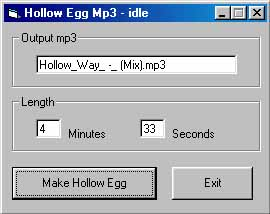



## Mp3 Hollow Egg

### Description

Heard of the Cuckoo Egg? It is a mp3 file of music with random sounds inserted in the mp3 file. It is done for musicians who wish to fight a battle with napster from within. Making a cuckoo egg can be slow and this program makes a Hollow Egg, which is kind of like the Cuckoo Egg except it makes a totally blank mp3 file that has the size, bitrate, and length of a real mp3.
 
### More Info
 

             |
---                |---
**Submitted On**   |2000-07-30 23:07:54
**By**             |[Spyda](https://github.com/Planet-Source-Code/PSCIndex/blob/master/ByAuthor/spyda.md)
**Level**          |Intermediate
**User Rating**    |3.7 (11 globes from 3 users)
**Compatibility**  |VB 5\.0, VB 6\.0
**Category**       |[Sound/MP3](https://github.com/Planet-Source-Code/PSCIndex/blob/master/ByCategory/sound-mp3__1-45.md)
**World**          |[Visual Basic](https://github.com/Planet-Source-Code/PSCIndex/blob/master/ByWorld/visual-basic.md)
**Archive File**   |[CODE\_UPLOAD8459812000\.zip](https://github.com/Planet-Source-Code/spyda-mp3-hollow-egg__1-10271/archive/master.zip)

